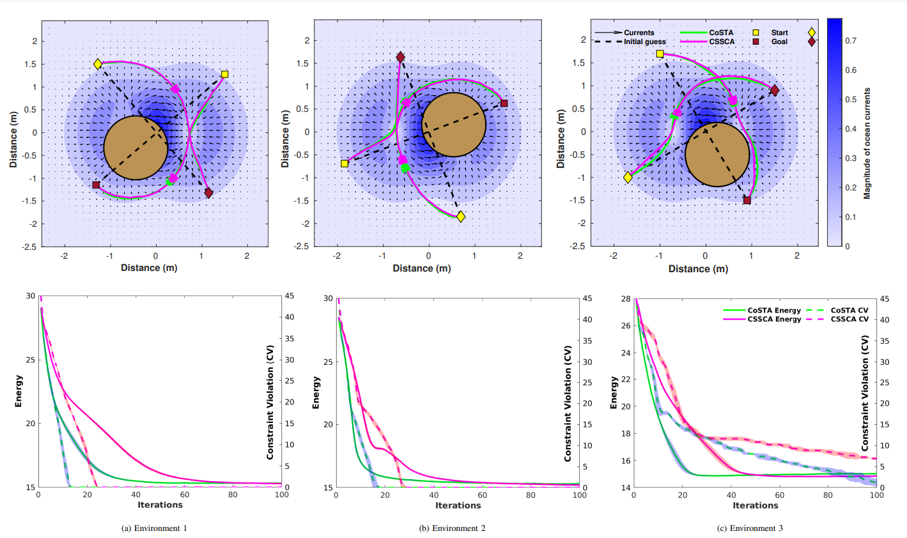

# Energy Efficient Trajectory Planning in Ocean Environments using CoSTA

Matlab code for multi-agent enery efficient trajectory planning in uncertain ocean currents. The approach uses a novel recursive momentum-based accelerated successive convex approximation (SCA) algorithm named Constrained STORM Successive Convex
Approximation (CoSTA) Algorithm. 

Read mode about the algorithm and application in the paper here:

[arxiv link here](http://arxiv.org/)

To replicate the results in section V-B for the application discribed in section II in the above article run the main file 'experiments_final' in matlab. Figures are generated and saved in plots folder inside the main directory.

Environment and configuration parameters
| Environment No. | theta |
| :---:   | :---: |
| 1 | -80 |
| 2 | 80  |
| 3 | 0   |
| 4 | 40  |

